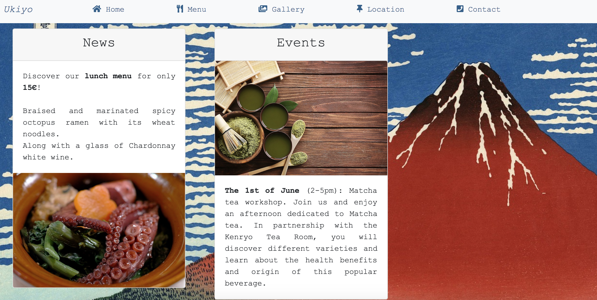
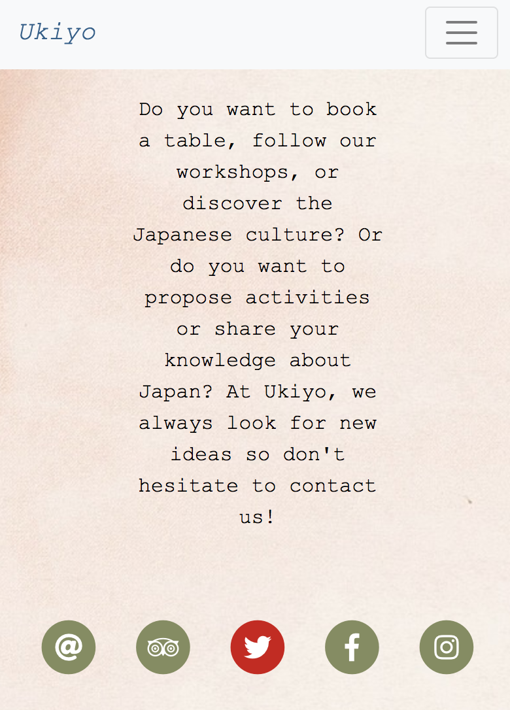

# Restaurant website / UKIYO  

## [Instructions](https://github.com/becodeorg/Johnson2/tree/master/projets/Restaurant_Bootstrap)

Project realised during **BECODE.org** training (Team Johnson II). 
From 28th of May until the 31st of May (+ modifications in July)

Create a 5pages-website for a restaurant:  
* Home
* Menu
* Gallery
* Location
* Contact  

To use:
* HTML
* CSS
* BOOTSTRAP framework
* +: Integration of SERVICE WORKER.
* Page 404

## Project: UKIYO

Solo project: *Japanese restaurant*. 

Fully responsive. 

### Screenshots

  
  

